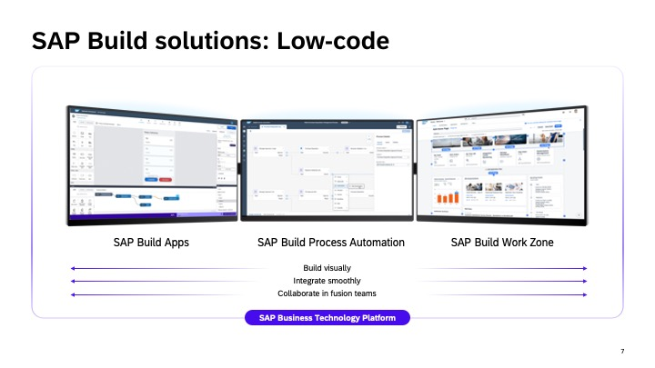
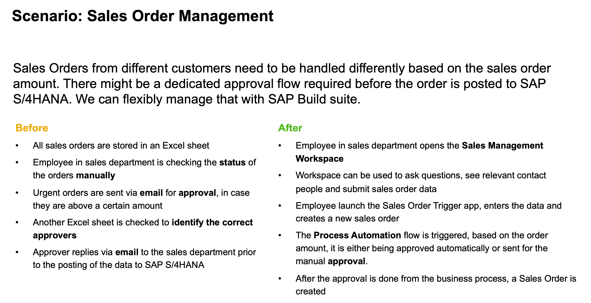
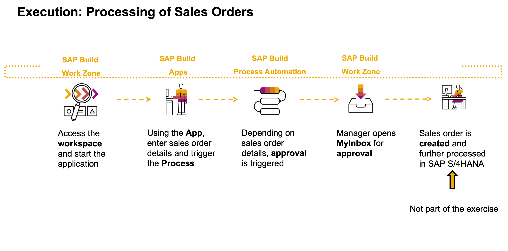

# Create App and Processes with SAP Build Solutions

## Description

This repository contains a tweaked **Hydro** version of the SAP TechEd 2023 session called **AD180v - Create Apps, Processes, and Workspaces with SAP Build Solutions**.

You will learn how to accelerate development and automation without writing code. Experience how to leverage simple drag-and-drop capabilities to solve complex business problems and build delightful solutions. Extending or improving standard business process running in business solutions like SAP S/4HANA. 
The combination of SAP Build Process Automation, SAP Build Apps and SAP Build Work Zone makes the difference. 

## Overview

SAP Build provides solutions to extend and automate processes, create apps or design business sites. In this exercise you will extend and automate a processes and build an app. To view it (on Work Zone) one of the tech people at Hydro will help you! 

The scenario, a common use case, which you will find in almost every organization.

The exercises are dependent to each other, so please follow the flow accordingly.

## Requirements

Please use **Google Chrome browser** for the best experience.

We have provided you with links, users etc in the Outlook calendar invite for this workshop!  

## Exercises

- **Exercise 1 - Create a Sales Order Process with SAP Build Process Automation** (90 minutes)
    - [Exercise 1.1 - Create Sales Order Business Process](exercises/1_Build_Process_Automation/1_1_spa-academy-salesorder/spa-academy-salesorder.md)
    - [Exercise 1.2 - Run the Sales Order Business Process](exercises/1_Build_Process_Automation/1_2_spa-academy-run-salesorderprocess/spa-academy-run-salesorderprocess.md)
  
- **Exercise 2 - Create a Sales Order App with SAP Build Apps** (60 minutes)
    - [Exercise 2.2 - Create an app in SAP Build App to trigger Process](exercises/2_Build_Apps/2_build-apps-workflow-trigger/build-apps-workflow-trigger.md)
    - [Exercise 2.3 - Build your SAP Build App for Work Zone deployment](exercises/2_Build_Apps/3_build-apps-deploy/build-apps-deply.md)
  
- **Exercise 3 - Admire your super duper nice app on your pc or mobile phone** (45 minutes)
     - [Exercise 3.1 - Experience the End-to-End Flow](exercises/3_Build_Work_Zone/5_EndtoEndRun/Run.md)
     - [Exercise 3.2 - Access Work Zone and run you app using Mobile Start](exercises/3_Build_Work_Zone/5_EndtoEndRun/Mobile.md)

With the last exercise, you will experience the following flow:

