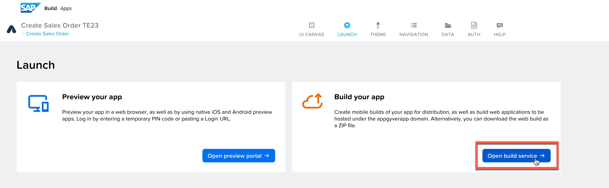
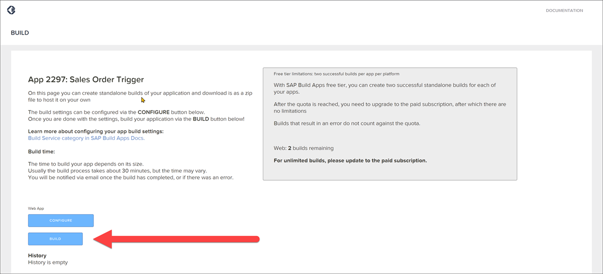
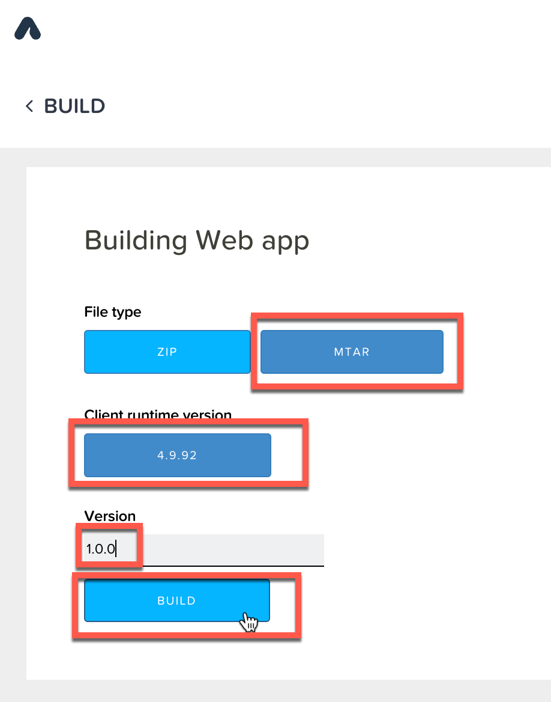
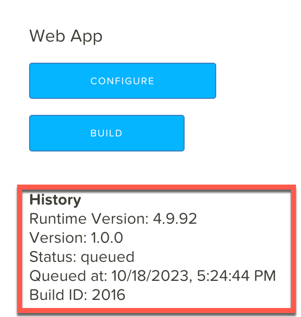
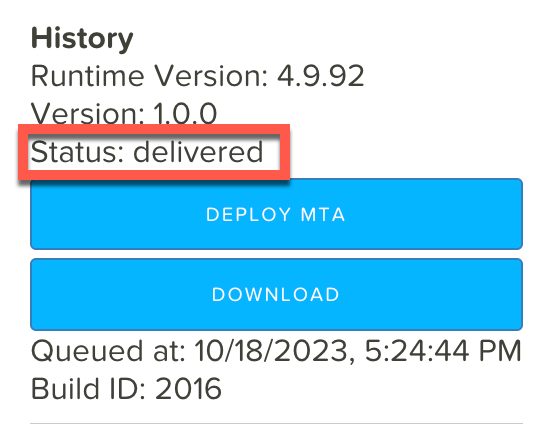

# Deploy app from SAP Build App to SAP BTP
<!-- description --> Build an app created with SAP Build Apps.

## You will learn
- How to build an app created with SAP Build Apps

## Intro
After creating an app in SAP Build Apps, and after viewing the preview on the web, you can build your app. In this scenario you will just share the app with one of our developers who will deploy and add it to our Work Zone for you. 

### Build the app
1. Open the **Launch** tab.
   
2. Select **Open Build Service**.
   
    

3. Underneath Web App click **Build**.

    

4. Select **MTAR**.
   
    Select the most current runtime version.

    Enter a version for your app, for example `1.0.0`.

    

5. Click **Build**.

The build may take a a little while (20 minutes or so). Take a breath and have a break.
If you refresh the page, the status will change from `created` to `queued` to finally `delivered`.

### Build app
Before deploying, you must have a build showing as `delivered`.

1. Click **Download**.

    Save the MTAR file on your OneDrive sand share it with Meike Wietkamp <Meike.Wietkamp@hydro.com>. She will deploy you app and also add it to Work Zone so you can enjoy you delightful app! 
