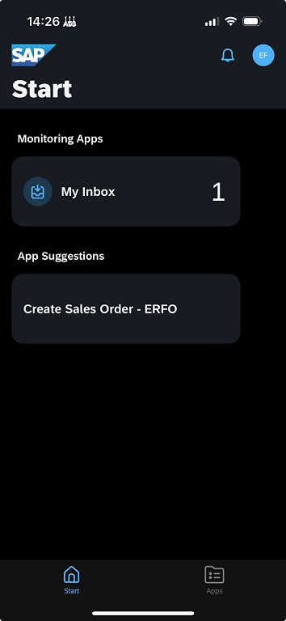

# Run the scenario in the Mobile Start app on your phone or ipad

In this exercise, you will log on to Work Zone with your iPhone of iPad using the app called Mobile Start! 

## Prerequisite
- You have done all the steps before this step 
- You have a phone or ipad that is an Hydro enrolled device (we have tested this using iPhone and iPad, we have not tested this using Android... Sorry Aksel!)

## Steps to run your app on you ex. phone 

1.	Open Work Zone on your desktop using Chrome and click on Settings in the top right corner
 

2. Select SAP Mobile Start Application
    - If you do not have the app called "SAP Start" on your phone, use your phone camera and scan the QR code -> install the app!
    - When you have the app "SAP Start" on your phone, use the switch button and change it to "Register" (Not Install). Open the app "SAP Start" and scan the QR code to be logged on to the Work Zone we use in this tutorial! 

 

3. Hopefully you are able to install the app and also log on to the Work Zone tenant we use in this tutorial. Then you can trigger a sales order and also approve it with your phone!  

 

## Summary

Congratulations. You are now a SAP Build god! 

 