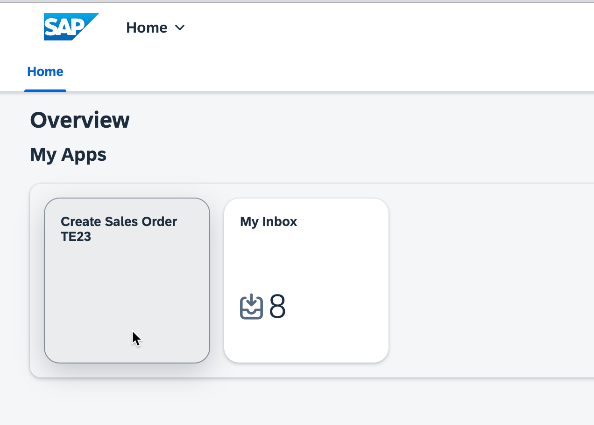
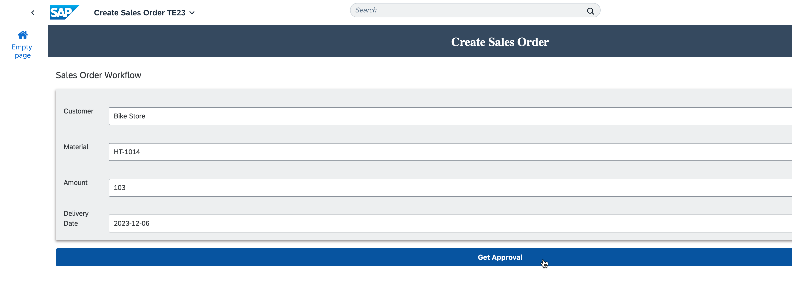
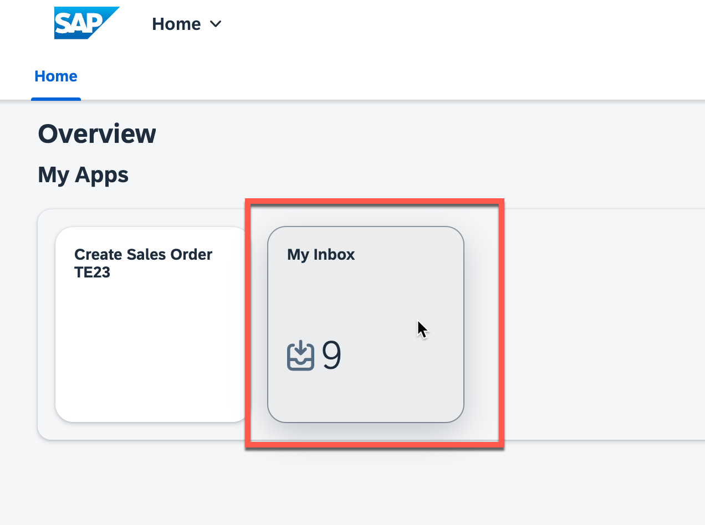
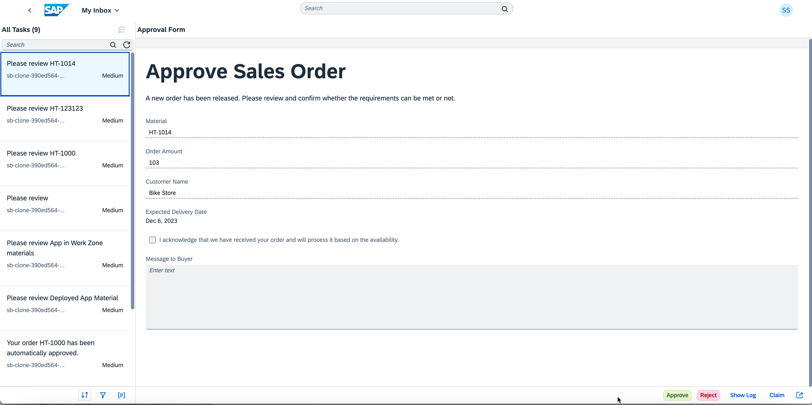

# Run the scenario

In this exercise, you will run the scenario end-to-end, including SAP Build Work Zone, SAP Build Apps and SAP Build Process Automation.

## Prerequisites
You have done all the steps in this tutorial including sharing your MTAR file with Meike. Once Meike let you know that your app is deployed, you can continue with this exercise. 

## Work on your tasks

1.	Log on to Work Zone (using the link in the Outlook calendar invite) and open your app **Create Sales Order by bla bla bla something**
 

2. Maintain any data and select **Get Approval**.
    - Ensure your amount is above 100, to trigger the approval step.
    - Ensure you have used the right date format: YYYY-MM-DD

 

3. Go back and open the **My Inbox** app.

 

4. The new task is available for you with all the details you have entered before, either **Approve** or **Reject** it.

 

Congratulations! You have now created a working app and workflow! This solution stop after the workflow step, but in a real world solution a process would be started in the underlying S/4HANA system (or any other SAP system....)

Optional next execise: [Exercise 3.2 - Access Work Zone and run you app using Mobile Start](exercises/3_Build_Work_Zone/5_EndtoEndRun/Mobile.md)
